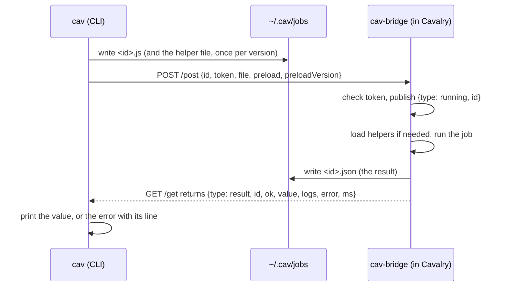
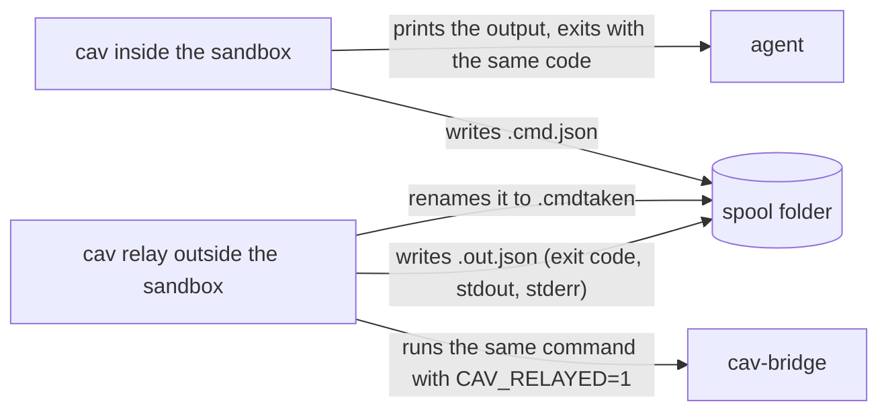

# cav architecture

How the `cav` CLI, the Cavalry bridge, the helper library and the agent skill fit together,
and how a request moves through them. For people who change this code.

Status: working on macOS with Cavalry 2.7.2 and 2.8.0. Windows code paths are written but
not tested. Updated 2026-10-01.

## Summary

An agent (or a person) drives a running Cavalry app from a shell. The `cav` CLI sends
JavaScript to a small bridge script that runs inside Cavalry, waits for the result, and
prints it. Everything else is built on that one path: renders, contact sheets, scene
checks, beat grids and offline search.

We chose a CLI and an Agent Skill instead of an MCP server. Driving Cavalry always needs a
desktop session with Cavalry open, so a shell is always available, and a CLI costs an agent
no context until it asks for help. The CLI also teaches the workflow (`cav guide`) and
enforces as much of it as it can (`cav check`, clear errors, "still running" instead of
"failed"). The skill is only an entry point that sends the agent to `cav guide`. In the
clean evaluation, the CLI alone did as well as the CLI with the old, longer skill, so the
guidance now lives in the CLI, where every agent can reach it.

Main limits today:

- The bridge runs on Cavalry's single JavaScript thread. One slow script blocks every
  other scene request. Status now reads existing state without queuing scene work,
  but its HTTP read can still time out while a native call blocks the UI thread.
- Starting or restarting the bridge needs the Cavalry GUI (Scripts menu).
- Windows is untested.

## Components

| Part | Where | Language | What it does |
|---|---|---|---|
| `cav` CLI | `cmd/cav`, `internal/*` | Go, standard library only | Every user-facing command. Talks to the bridge over HTTP, or through a spool folder when sandboxed. |
| cav-bridge | `assets/bridge/cav-bridge.js` | Cavalry JavaScript (UI script) | Listens on `127.0.0.1:8723`, runs jobs, publishes their state and result. |
| Helper library | `assets/helpers/cav-helpers.js` | Cavalry JavaScript | The global `cav` inside jobs: creation, keys, easing, motion recipes, native features. |
| API reference | `assets/apiref/*.json`, `tools/build_apiref.py`, `tools/api-notes.json` | JSON | Offline data for `cav api` and `cav types`. |
| Guides | `assets/guide/*.md` | Markdown | What `cav guide` prints: workflow, design recipes, music sync, traps, native features. |
| Skill | `plugins/cavalry/skills/cavalry` | Markdown | A short entry point: when to use `cav`, setup checks, and a pointer to `cav guide`. |
| Plugin packaging | `plugins/cavalry/*plugin.json`, `.claude-plugin/`, `.agents/plugins/` | JSON | Claude Code, Agent Plugins and Codex manifests and marketplace entries. |
| Installers | `install.sh`, `install.ps1` | shell, PowerShell | Download a release, verify its checksum, run `cav setup`. |

The Go binary embeds the bridge script, the helper library, the guides and the API reference
(`assets/assets.go`). The complete signed Cav.app is required for macOS distribution; its executable embeds
the runtime scripts and guides. Linux/Windows retain bare binary distribution.

The evaluation harness lives in `tools/evals/`. Its run data, fixtures, frozen snapshots
and scratch scenes live in `.plans/evals/`, which is not committed. The README summarises
its method and results.

## Files on disk

| Path | Written by | Contents |
|---|---|---|
| `~/.cav/token` | `cav setup` | 64 hex characters, mode 0600. Every request must carry it. |
| `~/.cav/jobs/<id>.js` | `cav` | The job script. Deleted after the job finishes. |
| `~/.cav/jobs/<id>.json` | bridge | The job result. Kept for a day, so `cav job wait <id>` works after the fact. |
| `~/.cav/jobs/cav-helpers-<version>.js` | `cav` | The helper library the bridge preloads. |
| `~/.cav/operations/<id>.json` | cav | Durable command phases, jobs, output and partial checkpoints; private, retained. |
| `~/.cav/operations/profile-<id>/` | cav/bridge | Cumulative measured samples and optional PNGs. |
| `~/.cav/last-job` | `cav` | Id of the most recent job, for `cav job wait` without an id. |
| `~/.cav/cache/docs/` | `cav docs update` | Downloaded Cavalry docs pages and the search index. |
| `<Cavalry Scripts>/cav-bridge.js` | `cav setup` | The bridge script. macOS: `~/Library/Application Support/Cavalry/Scripts`. Windows: `%APPDATA%\Cavalry\Scripts`. |

`CAV_HOME` moves `~/.cav`. `CAV_SCRIPTS_DIR`, `CAV_BRIDGE_HOST` and `CAV_BRIDGE_PORT` override
the other defaults.

## How a job runs

A job is a piece of JavaScript that runs inside Cavalry. `cav run`, `cav scene`, `cav tree`,
`cav frame`, `cav sheet`, `cav check` and `cav render` all build a job and send it the same
way.

The client reads the result from whichever comes first: the result file or the GET payload.
It needs both because the GET payload holds only the latest job, and another client may
have replaced it.

### Job states and exit codes

`cav` never reports a long job as failed. It distinguishes these cases:

| Situation | What the client sees | Exit code |
|---|---|---|
| The job finished | result with `ok: true` | 0 |
| The script threw | result with `ok: false`, message, line | 1 |
| Nobody listens on the port | connection refused | 2 |
| Cavalry accepts the connection but does not answer in 30 s | "listening but not answering" | 2 |
| The wait budget expires without a result | operation/job id and pending/unknown native outcome | 3 |
| A job wait sees connection refusal or an operation sees a changed session | bridge lost, unknown native outcome and retained artifacts | 4 |
| A raw job wait sees no answer for 120 s | "bridge lost", unknown native outcome | 4 |
| `cav job wait` on an id that is not queued, running or stored | "unknown job" after 5 s | 1 |

After 10 s without an answer during a job, `cav` prints "Cavalry is busy (not answering)"
and keeps waiting. Cavalry cannot answer HTTP while a native call blocks its main thread,
for example while it deletes hundreds of layers.

### Inside the bridge

The bridge is one UI script (`Scripts > cav-bridge`). It uses Cavalry's `api.WebServer`.
The WebServer's own callback polls about once per second, so the bridge also runs an
`api.Timer` every 50 ms to pick up requests faster. A small job takes about 60 ms end to
end (measured on an M-series Mac).

For each request the bridge:

1. checks the token;
2. publishes `{type: "running", id}` on GET;
3. installs its per-job environment: console capture, the `api` error wrapper, the `cav`
   helpers, and, for `--restricted` jobs, stubs for `api.runProcess` and
   `api.runDetachedProcess`;
4. runs the code as `(0, eval)('(function() {' + code + '})')()`, so `return` works and the
   code runs in global scope;
5. removes the per-job environment, writes the result file and publishes the result.

The error wrapper exists because errors thrown by Cavalry's native functions carry no stack.
The wrapper rethrows them as JavaScript errors that name the call and its arguments, so the
CLI can print the failing line of the user's script.

### Isolation from other scripts

Since 0.4.0 the bridge keeps all its state inside one function. It adds nothing global while
idle: the `api` wrapper and the `cav` helpers exist only while a cav job runs.
`assets/bridge/test/isolation.test.js` loads the bridge in a sandboxed context and fails if it
defines a global name, leaves `api` changed after a job, or lets job code read its token.

This is a precaution, not the fix for an observed bug. We first believed that all UI scripts
share one global scope and that cav-bridge clashed with the cavalry-mcp bridge, because
cavalry-mcp requests came back in cav-bridge's format. The real cause was a port forwarder
that an eval agent had started (see [evaluation.md](evaluation.md)). On Cavalry 2.8.0 we
checked that a cav job cannot see the cavalry-mcp bridge's top-level names, so each UI script
has its own global scope there. We did not check Cavalry 2.7.2.

Two bridges still must not share a token: each bridge runs any request that carries its
token, whatever port it came in on.

Job code runs in the bridge's global scope. A job can leave values on `globalThis`, and
they survive until the bridge restarts. This is deliberate: scripts use it to pass ids
between runs.

## The helper library

`cav-helpers.js` defines the global `cav` inside one function. `cav` embeds the file and
sends it as the job's `preload`. The bridge evaluates it once per bridge session and again
when the version changes. The version is the semver in the file plus the first 10 hex digits
of its SHA-256, so any edit reloads it.

Lines that start with `//@` form the reference that `cav helpers` prints. Keep them next to
the code they describe.

Design rules the helpers follow, each learned from a silent failure in Cavalry 2.7.2 (the
full list is in `cav guide traps`):

- New layers are created with the selection cleared, because `api.create` nests a new layer
  next to the current selection.
- `+y` is up and `(0, 0)` is the comp centre.
- Colour keys use separate `.r/.g/.b` channels, because hex strings on colour keys are ignored.
- Rotation keys go on `rotation.z`; keys on `rotation` are dropped.
- A single number for a two-value attribute is expanded to both values; Cavalry would set
  `(0, 0)`.
- Reading a value at another frame (`valueAt`) avoids moving the playhead when it can. A
  playhead move re-evaluates the whole scene. If the attribute has no keys, or the frame is
  before its first key or after its last, the value is read directly (from the keyframe node
  in the second case).

## Flows

### Long jobs and `cav job wait`

`cav run --timeout 10m` waits up to ten minutes, then exits with code 3 and the job id. The
native call may keep running inside Cavalry; timeout does not prove it is alive or complete.
`cav operation resume <id>` continues a tracked command. `cav job wait <id>` waits only
for one job. Because results are
kept for a day, `cav job wait` also works for a job that has already finished and been
printed.

### Sandboxed agents: spool and relay

Some agent sandboxes allow no connection to `127.0.0.1` and allow writes only in their own
folder. For those, `cav` has a spool mode.

Spool mode is on when `CAV_SPOOL` is set, or when a `.cav-spool` file exists in the current
folder or a parent. The file holds the spool path, absolute or relative to the file.

In spool mode `cav` forwards whole command lines, not only jobs, so commands that also read
files or run ffmpeg (`cav render`, `cav beats`) work the same. The relay runs each command in
the agent's working folder.

- Some commands never go through the relay because they need nothing from outside:
  `help`, `version`, `helpers`, `guide`, `api`, `types`, `relay`.
- The relay refuses `setup`, `update` and `relay`.
- Each request runs on its own goroutine, so one slow command (a long `cav job wait`)
  cannot hold up the others. Requests are renamed before they run, so two workers never
  take the same one.
- `--restricted` stubs out the process-launching APIs during relayed jobs. This catches
  accidents, not attacks: any job can use every scripting API, including file access.

The evaluation harness uses this mode to run agents inside Pioneer's sandbox.

### Rendering a video

`cav render` uses a render-queue item named `cav render`, created on first use, with the
`renderMP4` generator. It points the item at the requested output path and frame range and
renders it. Then it counts the video packets with `ffprobe` and prints a warning if the
count differs from the frame range. With `--audio`, ffmpeg copies the video stream and adds the audio as
AAC at 192 kb/s, trimmed to the video length.

A new render-queue item can inherit the output folder of another project. `cav render`
always sets the path itself for that reason.

### Contact sheets and frames

`cav frame` renders PNG frames through the same job path. `cav sheet` renders several frames
at a reduced scale and tiles them into one PNG (`internal/sheet`). Each tile is labelled
below the picture, never on it, with the frame number, the time and, with `--bpm`, the beat
number. The labels use a small built-in bitmap font, so no font files are needed.

`cav onion` renders 2 to 24 frames and blends them into one image (`internal/sheet/onion.go`).
The "still" picture under the ghosts is, per pixel, the first frame's colour when the first
and last frames agree there; otherwise the flat background colour if any frame shows it
there; otherwise the median frame. This keeps an object that eases in and then holds
for most frames counted as moving. Pixels that differ from the still picture are drawn per
frame, oldest first, fainter and tinted blue to orange; the last frame is drawn solid,
untinted and outlined in white. It also reports, for each pair of neighbouring frames, the
share of pixels that changed by more than 24 of 255 in any channel, and the box around them.

Forge Dynamics and particles simulate only when frames render in order, so a step-1 range
(`0-59:1`) is the only correct way to preview them.

### `cav check`

`cav check` first runs the bounded structural pass in `assets/diagnostics/structure.js`.
It reads metadata/connections, warns on per-copy JavaScript (including duplicated source
layers), nested Duplicators, fan-out and simulations, and provides supported static copy
estimates. It makes no frame changes, bounding-box calls or renders. `--quick` stops there.

Default visual checking bounds layers, animated attributes/keyframes and frame evaluations.
Every caught inspection error and omitted check appears in failures/skipped coverage; the
original playhead is restored in finally. Simulations skip jumping visual checks. Blank
head/tail duration is deliberately outside this bounded pass. Historical visual rules were
tuned on saved evaluation scenes; that evidence does not validate this new sampling policy.

Optional profiling runs a small frame set in one chronological job. Simulations use only
consecutive initial frames. It writes partial progress between native calls, measures
setFrame and optional PNG API calls separately, and restores the original playhead on
normal/recoverable completion. The first sample's cache state is unknown. No layer is
mutated for attribution. See [diagnostic semantics](recovery.md).

### Beats

`cav beats` decodes audio with ffmpeg and finds the tempo, beats and downbeats
(`internal/beats`). It works on spectral flux plus a low-band energy curve. It estimates the
tempo by autocorrelation, with a prior around 120 BPM and a check for half and double tempo.
It tracks the beats with dynamic programming, then fits a steady grid. Downbeats come from
low-band energy. The output lists each beat as a time and as a frame at `--fps`.

Tempo detection can land on half or double the real tempo. `--bpm` limits the search to ±8 %
of a known value.

With an audio file, `cav beats` also describes the track (`internal/beats/profile.go`). A
second short-time Fourier transform (2048-sample window, 256-sample hop at 22 050 Hz) gives
96 log-spaced bands from 40 Hz to 11 kHz, RMS loudness, three coarse bands (below 150 Hz,
150 Hz to 2 kHz, above 2 kHz) and an onset curve per coarse band, each scaled on its own
so that hi-hats do not outrank kicks and stabs.

- Sections: one feature vector per beat (loudness, the three bands and 8 spectral bands,
  each scaled to unit spread). Novelty after Foote (2000) compares the 8 beats before each
  beat with the 8 after. Peaks above the mean plus 0.75 standard deviations become
  boundaries, moved onto a downbeat within one beat, at least 8 beats apart.
- Events: a silence is 0.15 s or more at 35 dB below the loud parts of the track. A rise or
  fall is a beat at least 6 dB louder or quieter than the two beats before it; runs within
  2.5 beats are merged. Loudness over a stretch is averaged as power, and only analysis
  windows that lie wholly inside the stretch count, so a hit does not leak into the beat
  before it.
- Accents: the strongest onset peaks, at least 100 ms apart, at most 1.5 per second.

Checked on the launch video's track, whose layout is written down in `launch-video/plan.md`:
the drop at 4 s, the stabs at 46 s, the one-beat pause at 51.5 s, the hit at 52 s and the
final chord at 56 s all appear as events. The section boundaries are less exact: the hit at
52 s is not a boundary.

`cav spectrogram` draws the profile (`internal/beats/picture.go`). `cav sync` decodes a
rendered video at 160x90 in grey and measures the mean change between neighbouring frames
(`internal/beats/video.go`). A cut is one frame that changes 4 times more than its
neighbours. A peak is the top of a bump that rises clearly above the valleys around it and
above the 3 frames before it: the fastest frame of a move. A stop is a fall to near rest
straight from full speed. Each hit is measured against the nearest detected beat or half way
between two detected beats, so a track that drifts in tempo is judged against its real beats;
within about 35 ms counts as on the grid.

### Offline search

- `cav api` searches the scripting API: names and signatures from cavalry-types (MIT), plus
  our own notes on traps (`tools/api-notes.json`). `tools/build_apiref.py` rebuilds
  `assets/apiref/api.json`.
- `cav types` lists the layer type ids that `api.create` accepts (274 types, 24 marked
  experimental).
- `cav docs` searches the Cavalry documentation. The docs have no licence, so they are not
  shipped. `cav docs update` downloads about 520 pages from the public sitemap to the user's
  own cache and builds the index there.

Both searches use BM25 over tokens with camelCase splitting and light stemming
(`internal/search`).

## Setup, update and versions

- `cav setup` is safe to run again. It creates the token, installs or updates the bridge
  script, checks Cavalry and ffmpeg, builds the docs index and checks the running bridge.
  `cav doctor` runs the same checks without changing anything.
- Each request and each bridge payload carries a protocol number (1 today). The bridge
  refuses a request with another protocol, and `cav` then exits with code 2 and says how to
  fix it. `cav doctor` fails on a mismatch. A bridge from before 1.0 sends no protocol; it
  speaks protocol 1, which has not changed since 0.1.
- An older running bridge with the same protocol is a warning, not a failure. Restarting the
  bridge window brings the new version.
- `cav update` downloads a GitHub release, verifies it against the release's
  `checksums.txt`, preserves and verifies the whole signed macOS bundle (or replaces the
  Linux/Windows binary), and runs `cav setup`. It asks first unless `--yes` is
  given, and nothing updates on its own.
- One semver version covers the CLI, the plugins, the skill, the bridge script and the helper
  library. `cav version` prints the CLI, the helper library (with its hash) and the bridge
  script that this `cav` installs. `tools/check-versions.sh` checks, or with `--set` writes,
  the version in every one of those files. `RELEASING.md` describes the release steps.

## Tests

| Command | What it covers |
|---|---|
| `go test ./...` | Search, beat detection, `cav check` still-gap logic, helper-name hints, packaging contracts (manifests agree, skill frontmatter, installer copies match). |
| `node --test assets/helpers/test/*.test.js` | Helper library against a mocked `api`. |
| `node --test assets/bridge/test/*.test.js` | Bridge isolation (see above). |
| `cav run assets/helpers/test/live.js` | 65 checks inside a real Cavalry, in a throwaway scene. |
| `cav run assets/helpers/test/live-native.js` | 14 checks of native-feature helpers inside Cavalry. |
| `claude plugin validate . --strict` | Claude Code plugin and marketplace manifests. |

The live tests delete every layer in the active comp. Run them only after
`cav scene new --force` in a scene you do not need.

## Known problems

- One slow script blocks the bridge for everyone. The CLI reports this honestly ("busy",
  "still running"), but cannot run two jobs at once.
- The Spring behaviour had no visible effect when connected from a script. `cav guide`
  recommends `spring`/`outBack` easing instead.
- `cav check` does not catch every layout fault. A panel's content built outside the panel's
  group is caught only when text ends up hidden behind the panel.
- The Windows installer and paths have not run on Windows.

## Durable operations

`internal/operation` stores private atomic command checkpoints. `render`, `check` and `run`
are operation-aware; other commands retain raw job semantics. Dispatch records the original
command and working directory, then applies a total context deadline. Internal JavaScript
calls checkpoint a prepared job and uncertain submission intent before POST. Completed
results are cached in the operation, independently of the bridge's one-day result cache.
Replaying a command consumes these jobs in order; changed code is rejected. No uncertain
job is re-submitted. Successful output is printed only after its completion checkpoint.

A kernel file lock serializes clients sharing CAV_HOME. Pending native jobs gate new
operations even after their CLI exits; unknown/stale records require explicit reconciliation
and abandonment. Read-only status observes atomic snapshots and existing GET/result files.
New bridges provide optional bridgeSession identity and completed-ID deduplication while
remaining compatible with protocol 1; old bridges require manual session confirmation.

Rendering stages video/mux beside the destination and atomically publishes by hard link
without overwriting existing files. ffmpeg and ffprobe honor the remaining CLI context.
Complete muxes and cached bridge work survive replay. Native blocking work can continue
past the deadline; no cancellation or heartbeat claims to interrupt it. See
[recovery](recovery.md) and [macOS release packaging](NOTARIZATION.md) for limits.
