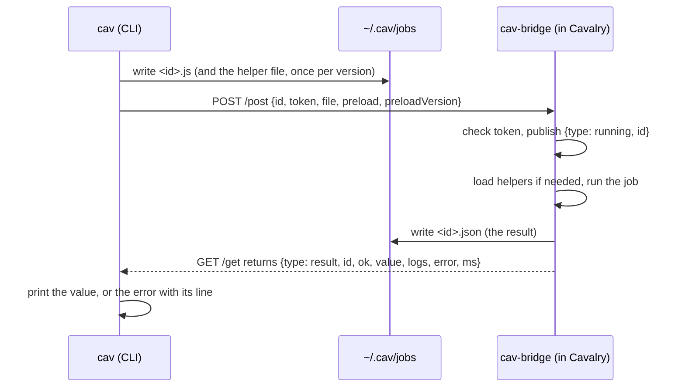
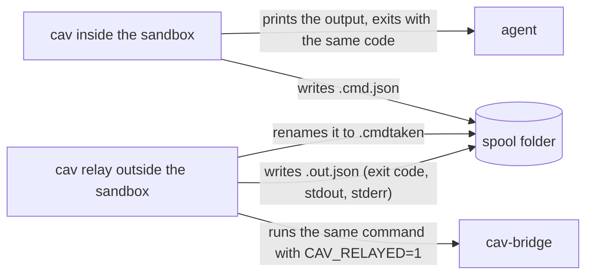

# cavalry-skill architecture

How the `cav` CLI, the Cavalry bridge, the helper library and the agent skill fit together,
and how a request moves through them. For people who change this code.

Status: working on macOS with Cavalry 2.7.2. Windows code paths are written but not tested.
Updated 2026-09-30.

## Summary

An agent (or a person) drives a running Cavalry app from a shell. The `cav` CLI sends
JavaScript to a small bridge script that runs inside Cavalry, waits for the result, and
prints it. Everything else is built on that one path: renders, contact sheets, scene
checks, beat grids and offline search.

We chose a CLI and an Agent Skill instead of an MCP server. Driving Cavalry always needs a
desktop session with Cavalry open, so a shell is always available, and a CLI costs an agent
no context until it asks for help. The skill teaches the workflow; the CLI enforces as much
of it as it can (`cav check`, clear errors, "still running" instead of "failed").

Main limits today:

- The bridge runs on Cavalry's single JavaScript thread. One slow script blocks every
  other request, including status checks.
- Starting or restarting the bridge needs the Cavalry GUI (Scripts menu).
- Windows is untested.

## Components

| Part | Where | Language | What it does |
|---|---|---|---|
| `cav` CLI | `cmd/cav`, `internal/*` | Go, standard library only | Every user-facing command. Talks to the bridge over HTTP, or through a spool folder when sandboxed. |
| cav-bridge | `assets/bridge/cav-bridge.js` | Cavalry JavaScript (UI script) | Listens on `127.0.0.1:8723`, runs jobs, publishes their state and result. |
| Helper library | `assets/helpers/cav-helpers.js` | Cavalry JavaScript | The global `cav` inside jobs: creation, keys, easing, motion recipes, native features. |
| API reference | `assets/apiref/*.json`, `tools/build_apiref.py`, `tools/api-notes.json` | JSON | Offline data for `cav api` and `cav types`. |
| Skill | `plugins/cavalry/skills/cavalry` | Markdown | The agent workflow, traps, motion recipes and native-feature recipes. |
| Plugin packaging | `plugins/cavalry/*plugin.json`, `.claude-plugin/`, `.agents/plugins/` | JSON | Claude Code, Agent Plugins and Codex manifests and marketplace entries. |
| Installers | `install.sh`, `install.ps1` | shell, PowerShell | Download a release, verify its checksum, run `cav setup`. |

The Go binary embeds the bridge script, the helper library and the API reference
(`assets/assets.go`). One file is enough to install and repair everything.

The evaluation harness lives in `.plans/evals/`, which is not committed. The README
summarises its method and results.

## Files on disk

| Path | Written by | Contents |
|---|---|---|
| `~/.cav/token` | `cav setup` | 64 hex characters, mode 0600. Every request must carry it. |
| `~/.cav/jobs/<id>.js` | `cav` | The job script. Deleted after the job finishes. |
| `~/.cav/jobs/<id>.json` | bridge | The job result. Kept for a day, so `cav job wait <id>` works after the fact. |
| `~/.cav/jobs/cav-helpers-<version>.js` | `cav` | The helper library the bridge preloads. |
| `~/.cav/last-job` | `cav` | Id of the most recent job, for `cav job wait` without an id. |
| `~/.cav/cache/docs/` | `cav docs update` | Downloaded Cavalry docs pages and the search index. |
| `<Cavalry Scripts>/cav-bridge.js` | `cav setup` | The bridge script. macOS: `~/Library/Application Support/Cavalry/Scripts`. Windows: `%APPDATA%\Cavalry\Scripts`. |

`CAV_HOME` moves `~/.cav`. `CAV_SCRIPTS_DIR`, `CAV_BRIDGE_HOST` and `CAV_BRIDGE_PORT` override
the other defaults.

## How a job runs

A job is a piece of JavaScript that runs inside Cavalry. `cav run`, `cav scene`, `cav tree`,
`cav frame`, `cav sheet`, `cav check` and `cav render` all build a job and send it the same
way.

The client reads the result from whichever comes first: the result file or the GET payload.
It needs both because the GET payload holds only the latest job, and another client may
have replaced it.

### Job states and exit codes

`cav` never reports a long job as failed. It distinguishes these cases:

| Situation | What the client sees | Exit code |
|---|---|---|
| The job finished | result with `ok: true` | 0 |
| The script threw | result with `ok: false`, message, line | 1 |
| Nobody listens on the port | connection refused | 2 |
| Cavalry accepts the connection but does not answer in 30 s | "listening but not answering" | 2 |
| The job is still queued or running when `--timeout` passes | job id and "still running" | 3 |
| The bridge stopped answering for 120 s during a job | "bridge lost" | 4 |
| `cav job wait` on an id that is not queued, running or stored | "unknown job" after 5 s | 1 |

After 10 s without an answer during a job, `cav` prints "Cavalry is busy (not answering)"
and keeps waiting. Cavalry cannot answer HTTP while a native call blocks its main thread,
for example while it deletes hundreds of layers.

### Inside the bridge

The bridge is one UI script (`Scripts > cav-bridge`). It uses Cavalry's `api.WebServer`.
The WebServer's own callback polls about once per second, so the bridge also runs an
`api.Timer` every 50 ms to pick up requests faster. A small job takes about 60 ms end to
end (measured on an M-series Mac).

For each request the bridge:

1. checks the token;
2. publishes `{type: "running", id}` on GET;
3. installs its per-job environment: console capture, the `api` error wrapper, the `cav`
   helpers, and, for `--restricted` jobs, stubs for `api.runProcess` and
   `api.runDetachedProcess`;
4. runs the code as `(0, eval)('(function() {' + code + '})')()`, so `return` works and the
   code runs in global scope;
5. removes the per-job environment, writes the result file and publishes the result.

The error wrapper exists because errors thrown by Cavalry's native functions carry no stack.
The wrapper rethrows them as JavaScript errors that name the call and its arguments, so the
CLI can print the failing line of the user's script.

### Isolation from other scripts

Every UI script in Cavalry shares one global scope. Until bridge 0.4.0, cav-bridge shared 17
top-level names (`execute`, `server`, `TOKEN`, `callbacks` and others) with the cavalry-mcp
bridge it was derived from. With both open, one bridge ran the other's jobs, and a stuck job
of one could stop the other from taking requests.

Since 0.4.0 the bridge keeps all its state inside one function. It adds nothing global while
idle: the `api` wrapper and the `cav` helpers exist only while a cav job runs.
`assets/bridge/test/isolation.test.js` loads the bridge in a sandboxed context and fails if it
defines a global name, leaves `api` changed after a job, or lets job code read its token.

Job code still runs in the shared global scope. A job can leave values on `globalThis`, and
they survive until the bridge restarts. This is deliberate: scripts use it to pass ids
between runs.

## The helper library

`cav-helpers.js` defines the global `cav` inside one function. `cav` embeds the file and
sends it as the job's `preload`. The bridge evaluates it once per bridge session and again
when the version changes. The version is the semver in the file plus the first 10 hex digits
of its SHA-256, so any edit reloads it.

Lines that start with `//@` form the reference that `cav helpers` prints. Keep them next to
the code they describe.

Design rules the helpers follow, each learned from a silent failure in Cavalry 2.7.2 (the
full list is in `references/gotchas.md` in the skill):

- New layers are created with the selection cleared, because `api.create` nests a new layer
  next to the current selection.
- `+y` is up and `(0, 0)` is the comp centre.
- Colour keys use separate `.r/.g/.b` channels, because hex strings on colour keys are ignored.
- Rotation keys go on `rotation.z`; keys on `rotation` are dropped.
- A single number for a two-value attribute is expanded to both values; Cavalry would set
  `(0, 0)`.
- Reading a value at another frame (`valueAt`) avoids moving the playhead when it can. A
  playhead move re-evaluates the whole scene. If the attribute has no keys, or the frame is
  before its first key or after its last, the value is read directly (from the keyframe node
  in the second case).

## Flows

### Long jobs and `cav job wait`

`cav run --timeout 10m` waits up to ten minutes, then exits with code 3 and the job id. The
job keeps running inside Cavalry. `cav job wait <id>` resumes waiting. Because results are
kept for a day, `cav job wait` also works for a job that has already finished and been
printed.

### Sandboxed agents: spool and relay

Some agent sandboxes allow no connection to `127.0.0.1` and allow writes only in their own
folder. For those, `cav` has a spool mode.

Spool mode is on when `CAV_SPOOL` is set, or when a `.cav-spool` file exists in the current
folder or a parent. The file holds the spool path, absolute or relative to the file.

In spool mode `cav` forwards whole command lines, not only jobs, so commands that also read
files or run ffmpeg (`cav render`, `cav beats`) work the same. The relay runs each command in
the agent's working folder.

- Some commands never go through the relay because they need nothing from outside:
  `help`, `version`, `helpers`, `api`, `types`, `relay`.
- The relay refuses `setup`, `update` and `relay`.
- Each request runs on its own goroutine, so one slow command (a long `cav job wait`)
  cannot hold up the others. Requests are renamed before they run, so two workers never
  take the same one.
- `--restricted` stubs out the process-launching APIs during relayed jobs. This catches
  accidents, not attacks: any job can use every scripting API, including file access.

The evaluation harness uses this mode to run agents inside Pioneer's sandbox.

### Rendering a video

`cav render` uses a render-queue item named `cav render`, created on first use, with the
`renderMP4` generator. It points the item at the requested output path and frame range and
renders it. Then it counts the video packets with `ffprobe` and prints a warning if the
count differs from the frame range. With `--audio`, ffmpeg copies the video stream and adds the audio as
AAC at 192 kb/s, trimmed to the video length.

A new render-queue item can inherit the output folder of another project. `cav render`
always sets the path itself for that reason.

### Contact sheets and frames

`cav frame` renders PNG frames through the same job path. `cav sheet` renders several frames
at a reduced scale and tiles them into one PNG (`internal/sheet`). Each tile is labelled
below the picture, never on it, with the frame number, the time and, with `--bpm`, the beat
number. The labels use a small built-in bitmap font, so no font files are needed.

Forge Dynamics and particles simulate only when frames render in order, so a step-1 range
(`0-59:1`) is the only correct way to preview them.

### `cav check`

`cav check` runs one job that inspects the active comp. It reports the problems we saw most
often in agent-made animations:

| Finding | Rule |
|---|---|
| `still` | A stretch longer than `--max-still` (1.5 s) where no large layer and fewer than three small layers change. Keys, oscillators, noise and particles count as change. Also reported when over half of the piece is still. |
| `text` | Text smaller than 28 px at 1080 px frame height. |
| `offframe` | Visible text or a large shape that never comes inside the frame, on a layer whose transform is not animated. |
| `clipped` / `edge` | Resting text cut by the frame edge, or closer than 3 % of the frame height to it. |
| `overflow` | Resting text that spills out of the nearest filled shape drawn below it (a pill, button or field), or whose side padding on a wide shape is under half the text height. |
| `hidden` | Resting text partly covered by an opaque shape drawn above it, unless a translucent overlay larger than a quarter of the frame dims it on purpose (a modal backdrop). |
| `blank` | An empty start of 0.75 s or more, or an empty end of 1 s or more (from quick low-resolution renders). |
| `keys` | Keys after the comp end. |

Every playhead move re-evaluates the scene, so the check batches its reads by frame. It
queues every lookup it needs for a frame, then visits each frame once. It samples up to 30
frames, plus the frame 2 later for each, to tell resting layers from moving ones. On the
eval scenes it takes 1 to 9 s.

These rules were tuned on 36 saved eval scenes. Every finding on those scenes was checked
against a rendered frame.

### Beats

`cav beats` decodes audio with ffmpeg and finds the tempo, beats and downbeats
(`internal/beats`). It works on spectral flux plus a low-band energy curve. It estimates the
tempo by autocorrelation, with a prior around 120 BPM and a check for half and double tempo.
It tracks the beats with dynamic programming, then fits a steady grid. Downbeats come from
low-band energy. The output lists each beat as a time and as a frame at `--fps`.

Tempo detection can land on half or double the real tempo. `--bpm` limits the search to ±8 %
of a known value.

### Offline search

- `cav api` searches the scripting API: names and signatures from cavalry-types (MIT), plus
  our own notes on traps (`tools/api-notes.json`). `tools/build_apiref.py` rebuilds
  `assets/apiref/api.json`.
- `cav types` lists the layer type ids that `api.create` accepts (274 types, 24 marked
  experimental).
- `cav docs` searches the Cavalry documentation. The docs have no licence, so they are not
  shipped. `cav docs update` downloads about 520 pages from the public sitemap to the user's
  own cache and builds the index there.

Both searches use BM25 over tokens with camelCase splitting and light stemming
(`internal/search`).

## Setup, update and versions

- `cav setup` is safe to run again. It creates the token, installs or updates the bridge
  script, checks Cavalry and ffmpeg, builds the docs index and checks the running bridge.
  `cav doctor` runs the same checks without changing anything.
- An older running bridge is a warning, not a failure: the request protocol has not changed
  since 0.1. Restarting the bridge window brings the new version.
- `cav update` downloads a GitHub release, verifies it against the release's
  `checksums.txt`, replaces the binary and runs `cav setup`. It asks first unless `--yes` is
  given, and nothing updates on its own.
- Versions follow semver. `cav version` prints three: the CLI, the helper library (with its
  hash) and the running bridge. `tools/check-versions.sh` checks, or with `--set` writes, the
  version in the three plugin manifests and the skill. `RELEASING.md` describes the release steps.

## Tests

| Command | What it covers |
|---|---|
| `go test ./...` | Search, beat detection, `cav check` still-gap logic, helper-name hints, packaging contracts (manifests agree, skill frontmatter, installer copies match). |
| `node --test assets/helpers/test` | Helper library against a mocked `api`. |
| `node --test assets/bridge/test` | Bridge isolation (see above). |
| `cav run assets/helpers/test/live.js` | 65 checks inside a real Cavalry, in a throwaway scene. |
| `cav run assets/helpers/test/live-native.js` | 14 checks of native-feature helpers inside Cavalry. |
| `claude plugin validate . --strict` | Claude Code plugin and marketplace manifests. |

The live tests delete every layer in the active comp. Run them only after
`cav scene new --force` in a scene you do not need.

## Known problems

- One slow script blocks the bridge for everyone. The CLI reports this honestly ("busy",
  "still running"), but cannot run two jobs at once.
- The Spring behaviour had no visible effect when connected from a script. The skill
  recommends `spring`/`outBack` easing instead.
- `cav check` does not catch every layout fault. A panel's content built outside the panel's
  group is caught only when text ends up hidden behind the panel.
- The Windows installer and paths have not run on Windows.
